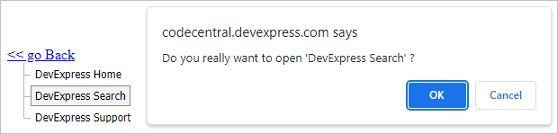

<!-- default badges list -->

[](https://supportcenter.devexpress.com/ticket/details/E3925)
[](https://docs.devexpress.com/GeneralInformation/403183)
<!-- default badges end -->

# Menu, NavBar, and TreeView for ASP.NET Web Forms - How to implement conditional navigation
<!-- run online -->
**[[Run Online]](https://codecentral.devexpress.com/e3925/)**
<!-- run online end -->

This example demonstrates how to implement conditional navigation with ASPxMenu, ASPxTreeView and ASPxNavBar controls. 



## Implementation Details

1. Do not specify the `NavigateURL` property for items or nodes to prevent default items behavior.
2. Assign navigate URL to item or node `Name` property. It allows you to access navigation URL from item or node context.
3. Handle the `ItemClick` or `NodeClick` event and perform conditional navigation as shown below.


### ASPxMenu

```aspx
<dx:ASPxMenu ID="menuExample" runat="server" ClientInstanceName="menu">
    <ClientSideEvents ItemClick="OnItemClick" />
    <Items>
	<dx:MenuItem Name="http://www.devexpress.com/" Text="DevExpress Home"/>
	<dx:MenuItem Name="http://search.devexpress.com/" Text="DevExpress Search"/>
	<dx:MenuItem Name="http://www.devexpress.com/Support/" Text="DevExpress Support"/>
    </Items>
</dx:ASPxMenu>
```

```js
function OnItemClick(s, e) {
    if (confirm("Do you really want to open '" + e.item.GetText() + "' ?"))
        window.open(e.item.name)
}
```

### ASPxNavBar

```aspx
<dx:ASPxNavBar ID="nvbExample" runat="server" ClientInstanceName="navBar">
    <ClientSideEvents ItemClick="OnItemClick" />
    <Groups>
        <dx:NavBarGroup>
	    <Items>
	        <dx:NavBarItem Name="http://www.devexpress.com/" Text="DevExpress Home"/>
	        <dx:NavBarItem Name="http://search.devexpress.com/" Text="DevExpress Search"/>
	        <dx:NavBarItem Name="http://www.devexpress.com/Support/" Text="DevExpress Support"/>
	    </Items>
        </dx:NavBarGroup>
    </Groups>
</dx:ASPxNavBar>
```

```js
function OnItemClick(s, e) {
    if (confirm("Do you really want to open '" + e.item.GetText() + "' ?"))
	window.open(e.item.name)
}
```

### ASPxTreeView


```aspx
<dx:ASPxTreeView ID="trvExample" runat="server" ClientInstanceName="treeView">
    <ClientSideEvents NodeClick="OnNodeClick" />
    <Nodes>
        <dx:TreeViewNode Name="http://www.devexpress.com/" Text="DevExpress Home"/>
        <dx:TreeViewNode Name="http://search.devexpress.com/" Text="DevExpress Search"/>
        <dx:TreeViewNode Name="http://www.devexpress.com/Support/" Text="DevExpress Support"/>
    </Nodes>
</dx:ASPxTreeView>
```

```js
function OnNodeClick(s, e) {
    if (confirm("Do you really want to open '" + e.node.GetText() + "' ?"))
        window.open(e.node.name)
}
```


## Files to Review

* [ASPxMenu.aspx](./CS/WebSite/ASPxMenu.aspx) (VB: [ASPxMenu.aspx](./VB/WebSite/ASPxMenu.aspx))
* [ASPxNavBar.aspx](./CS/WebSite/ASPxNavBar.aspx) (VB: [ASPxNavBar.aspx](./VB/WebSite/ASPxNavBar.aspx))
* [ASPxTreeView.aspx](./CS/WebSite/ASPxTreeView.aspx) (VB: [ASPxTreeView.aspx](./VB/WebSite/ASPxTreeView.aspx))
